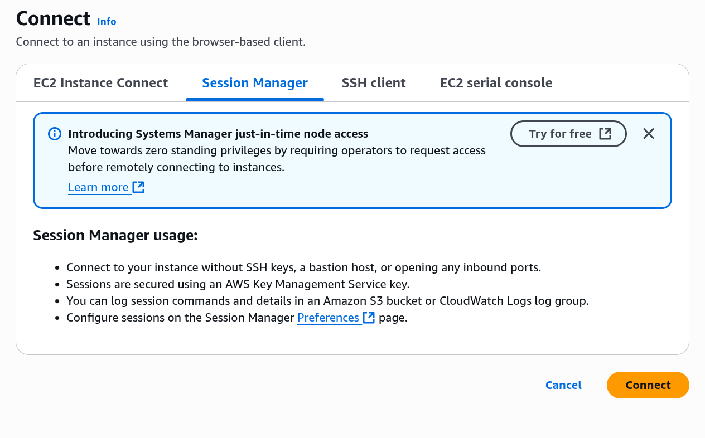
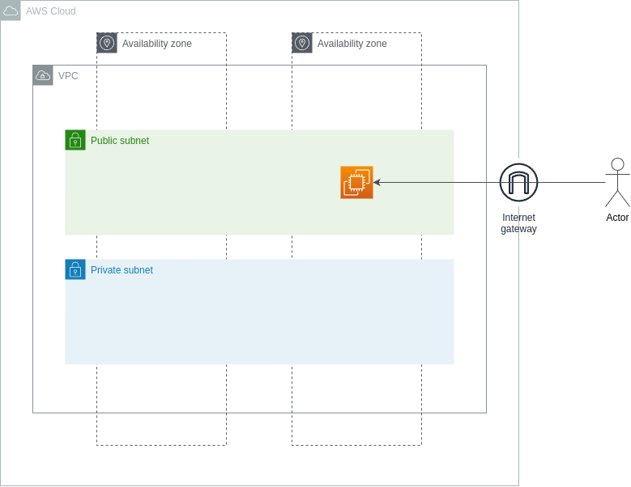
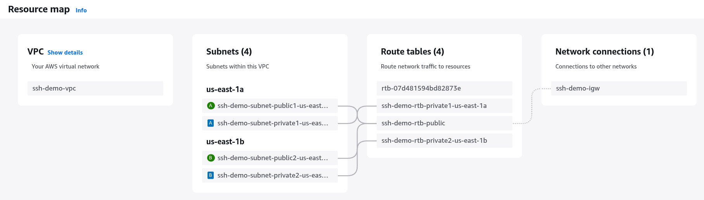
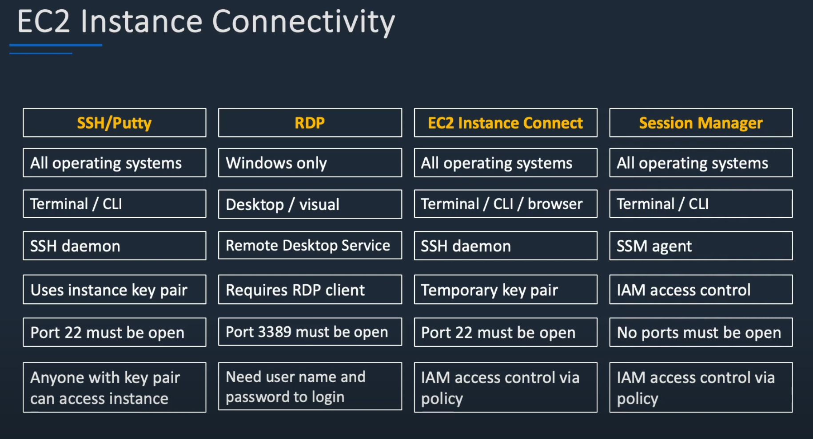

# AWS デモ：EC2

## 📚 6/16 やったこと

<br/>

## 🌐 EC2 + Apache を使った簡単な Web サーバーデモ

---

## 🎯 デモの目的

- AWS EC2 に接続して Web サーバーを立ち上げる
- シンプルな HTML ページを表示して「見える化」

---

## 🧱 構成概要

- EC2: Amazon Linux 2023 など
- Apache HTTP サーバー
- HTML/CSS/JS: `/var/www/html/index.html`
- SSM: AWS Systems Manager 経由で接続（SSH 不要）

---

## 🔧 ステップ 1: EC2 に接続する

SSM 経由でインスタンスに接続：

```bash
aws ssm start-session \
  --target i-xxxxxxxxxxxxxxxxx \
  --profile us-east-1 \
  --region us-east-1
```

## ステップ 2: Apache のインストール

```bash
dnf install -y httpd

sudo systemctl start httpd
sudo systemctl enable httpd

# HTML を設置
sudo tee /var/www/html/index.html > /dev/null <<'EOF'
<!DOCTYPE html>
<html lang="ja">
<head>
  <meta charset="UTF-8">
  <meta name="viewport" content="width=device-width, initial-scale=1.0">
  <title>EC2 デモページ</title>
  <style>
    body {
      font-family: sans-serif;
      background-color: #ffffff;
      color: #222;
      text-align: center;
      padding: 5rem;
      transition: background-color 0.3s, color 0.3s;
    }
    h1 {
      font-size: 2.5rem;
    }
    p {
      font-size: 1.25rem;
    }
    button {
      margin-top: 2rem;
      padding: 1rem 2rem;
      font-size: 1rem;
      cursor: pointer;
      border: none;
      border-radius: 5px;
      background-color: #333;
      color: white;
      transition: background-color 0.3s;
    }
    button:hover {
      background-color: #555;
    }
    .dark-mode {
      background-color: #222;
      color: #ddd;
    }
  </style>
</head>
<body>
  <h1>EC2 デモページ</h1>
  <p>これはデモです。</p>
  <button onclick="toggleDarkMode()">ダークモード切替</button>
  <script>
    function toggleDarkMode() {
      document.body.classList.toggle('dark-mode');
    }
  </script>
</body>
</html>
EOF
```

🌐 ステップ 3: ブラウザで確認

ブラウザで以下にアクセス：

```
http://<EC2のパブリックIP>:80
```

<br />

## 📚 6/12 やったこと

### 1. EC2 インスタンスへの接続

- Instance Connect での接続
- SSH での接続
- Session Manager での接続

#### Session Manager での接続は、今回同期されるまでに時間がかかりましたが、一旦同期されると以下のように connect ボタンが活性化されます



#### 参考：　少し古い記事ですが、Session Manager での接続方法については以下も参照してください

https://dev.classmethod.jp/articles/ec2-access-with-session-manager/

<br />
<br />
<br />

## 📚 復習：　 6/9 やったこと

### 1. 下記の構成で、

- VPC を作成
- Public Subnet に EC2 インスタンスを作成、起動
- ローカルマシンから、インスタンスに接続



### 2. 実際の AWS マネジメントコンソール上で見たリソース配置はこうです



### 3. インスタンスへの接続は以下の方法があります

- 本日は、Instance Connect のみ実施した
- Session Manager が推奨（一番安全）
- SSH、RDP は、セキュリティで劣る。昔ながらのやり方



## 🎯 内容

EC2 インスタンスの作成、セキュアな接続、アプリケーション起動までを実施します。

## 🧱 使用する AWS サービス

- Amazon EC2
- Amazon EC2 Security Group
- AWS Systems Manager
- AWS CloudFormation

---

## 🗂️ 構成概要

```

+------------------------+
| EC2 Instance |
|------------------------|
| OS: Amazon Linux 2023 |
| Node.js + Git |
| Port: 8080 Open |
+------------------------+
↑
|（SSM Session Manager 経由で接続）

```

---

## 🚀 デプロイ手順

### 1. CloudFormation スタックを作成

- AWS マネジメントコンソール → CloudFormation → 「スタックの作成」
- テンプレートファイル（`template.yml`）をアップロードする
- デフォルト設定のまま作成

### 2. EC2 インスタンスが起動したら確認

- EC2 → インスタンス一覧 → インスタンス が `running` になっていること

### 3. Systems Manager から接続

- Systems Manager → セッションマネージャー → セッションの開始
- 該当インスタンスを選択して接続

### 4. Web アクセスでアプリを表示

インスタンスの **パブリック IP アドレス** を確認し、ブラウザで以下にアクセス：

```

http://<EC2 のパブリック IP>:8080

```

---

## 🧼 クリーンアップ

- CloudFormation → スタックを選択 → 削除
- すべてのリソースが自動で削除されます

---

## 参考

- [Amazon Linux 2023 公式ドキュメント](https://docs.aws.amazon.com/linux/al2023/ug/)
- [Systems Manager セッションマネージャー](https://docs.aws.amazon.com/systems-manager/latest/userguide/session-manager.html)
- [Scotch.io Node ToDo App GitHub](https://github.com/scotch-io/node-todo)

---

```

```
